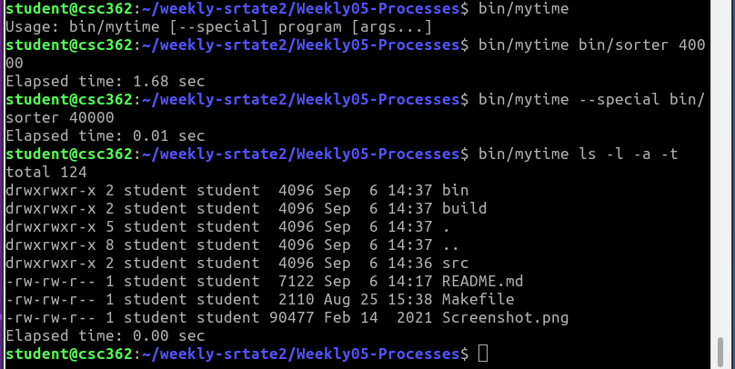

This is the README file for the fifth weekly assignment. Remember that
collaboration is allowed (but not required) on weekly assignments. If
you do collaborate with others, give their names here:

Sierra

Instructions on what to do are below.

## Learning Objectives

In this assignment you will work with processes to gain experience with

* Processing command line arguments sent into main()
* Creating argument arrays for an exec call
* Implementing the fork/exec/wait pattern
* Learning about two new functions from their man pages (setenv and
  clock_gettime)

## The complexity of this assignment

With this assignment we move from exploring a familiar-looking
programming language (C) to working with system calls -- something
that will be a brand new concept for many of you. As such, there are
some things that might take a little time to wrap your mind around
with this assignment, so please get an early start!

The code is not particularly long -- if you remove the fork/exec/wait
code that I took directly from our in-class activity solution, my
solution has just 22 lines of code, including all argument checking,
array creation, timing, and printing code. So while it's not a lot
of code, the new concepts might require you to do a little
experimentation to get right. If you wait until the last minute, you
might get into trouble!

## Instructions

In this assignment, you are to implement a program similar to the
standard `time` program that we saw earlier in the class. Your program
is called `mytime`, and the basic program template is given for you in
`mytime.c`. Just like the `time` program, your `mytime` program will
be given the name of a program to run and time, possibly with command
line arguments. The user may also give a "--special" option between
"mytime" an the name of the program to be timed, which should result
in the environment variable `SPECIAL` being set to 1 before executing
the program being timed.

There is also a program named `sorter` that is part of this repo. This
is just a sorting program that will sort some number of random
integers. It normally uses the selection sort algorithm, but if the
`SPECIAL` environment variable is set then it will use the `qsort`
function from the standard C library. You can look at the source code
of this program if you are curious about how it works, but *do not
change it in any way!*

Here are some examples of various ways that `mytime` can be
invoked. To time how long the sorter program takes to sort 50000
integers using selection sort, you can use:

```
   bin/mytime bin/sorter 50000
```

To set the `SPECIAL` environment variable, so that sorter uses the
`qsort` function, you can use

```
   bin/mytime --special bin/sorter 50000
```

To time how long the `ls` program takes to produce a long listing of
all files, sorted by time, use

```
   bin/mytime ls -l -a -t
```

To spell it all out, here's what the `mytime` program should do:

* Check for an appropriate number of arguments, and print a usage
  message if it was not invoked correctly (for example, if it was run
  without any arguments).

* Check for the `--special` option, and set the `SPECIAL` environment
  variable if it is present (see the man page for `setenv`). To check
  for `--special` you'll need to use the `strcmp` function with a
  specific `argv` value.

* Create and initialize the arguments array for the program you need
  to run. This will contain at least the program name, and any number
  of arguments that have been provided. Since you don't know in
  advance how many arguments that is, you cannot use a
  statically-allocated array for this --- you need to use `malloc`. Be
  very careful to understand what you are allocating: it's an array of
  character pointers, with one extra pointer for the `NULL` pointer
  marking the end. Make sure you allocate exactly the right amount of
  space -- this will be checked in grading!

  *Note: There is one "trick" that works in C and can avoid using
  `malloc` entirely. If you know what that is, or can figure it out,
  then feel free to do it that way. Just make sure that what you do
  works for any number of arguments, and does not violate any memory
  access rules.*

* Use the fork/exec/wait pattern to run the program with the
  appropriate arguments.

The last step needs to be surrounded by code that measures the amount
of time it takes. See "About Timers and Clocks" below for information
about how to do this.

Finally, your program should print out "Elapsed time: " followed by
the amount of time it took in seconds. Here's an example of what this
looks like in my VM:



### About Timers and Clocks

Measuring time seems like it should be really straightforward, but it
turns out this is more complex that it seems at first. First off, what
are you measuring? The amount of time that your program is actually
using the computer's CPU? What if it uses more than one core? Or are
you measuring "wall-clock" time (elapsed time in the real human
world)?

You should measure wall-clock time for this assignment, but even
that isn't as easy as it seems. If you ask the computer what time it
is, and then ask it again after one second, the second time reported
might actually be *two* (or more) seconds after the first! That seems
impossible, but here's what happens: On a modern system, the operating
system occasionally adjusts the clock to keep it synchronized with a
time source. If your computer finds that its clock was running slow
compared to the authoritative time source on the Internet then it will
automatically set your clock forward so that it shows the correct
time. If that adjustment happens during the time span that you were
measuring then you'll get inaccurate elapsed times. While it's not
part of this class, if you want to see more about how this works look
up [NTP](https://en.wikipedia.org/wiki/Network_Time_Protocol) - the
Network Time Protocol.

A clock that jumps around like this can cause lots of problems for
software, which often requires reliable elapsed time
measurement. Because of this, Linux provides multiple different timers
with various properties. The C function that you'll call to measure
the time is clock_gettime - you'll need to study the [man
page](https://man7.org/linux/man-pages/man2/clock_getres.2.html) to
learn how this works. On the man page, notice that there is a list of
the various clocks you can query -- the one you want to use for
measuring elapsed time of a running program is `CLOCK_MONOTONIC_RAW`. Make
sure you understand how this function is called - here's the basic
idea in two lines of code, but make sure you understand *why* this is
correct, based on the man page:

```
    struct timespec start_time;
    clock_gettime(CLOCK_MONOTONIC_RAW, &start_time);
```

For the elapsed time, you'll need the start time (before you fork/exec
your program) and an end time (after the wait says it's done), and
then subtract them. The time is given in two pieces though, seconds
and nanoseconds, as described on the man page. You'll need to figure
out how to process this!
